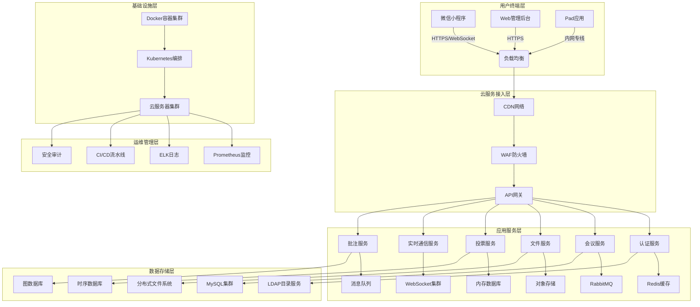

```mermaid
graph TD
    subgraph 用户终端层
        A[微信小程序] -->|HTTPS/WebSocket| B(负载均衡)
        C[Web管理后台] -->|HTTPS| B
        D[Pad应用] -->|内网专线| B
    end
    
    subgraph 云服务接入层
        B --> E[CDN网络]
        E --> F[WAF防火墙]
        F --> G[API网关]
    end
    
    subgraph 应用服务层
        G --> H[认证服务]
        G --> I[会议服务]
        G --> J[文件服务]
        G --> K[投票服务]
        G --> L[实时通信服务]
        G --> M[批注服务]
        
        H --> N[Redis缓存]
        I --> O[RabbitMQ]
        J --> P[对象存储]
        K --> Q[内存数据库]
        L --> R[WebSocket集群]
        M --> S[消息队列]
    end
    
    subgraph 数据存储层
        I --> T[MySQL集群]
        J --> U[分布式文件系统]
        K --> V[时序数据库]
        M --> W[图数据库]
        H --> X[LDAP目录服务]
    end
    
    subgraph 基础设施层
        subgraph Docker容器集群
            H
            I
            J
            K
            L
            M
        end
        Docker容器集群 --> Y[Kubernetes编排]
        Y --> Z[云服务器集群]
    end
    
    subgraph 运维管理层
        Z --> AA[Prometheus监控]
        Z --> AB[ELK日志]
        Z --> AC[CI/CD流水线]
        Z --> AD[安全审计]
    end

```